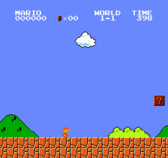
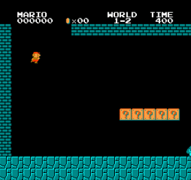
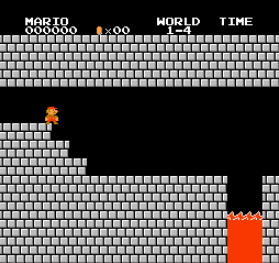
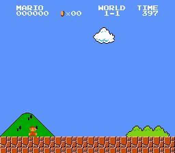
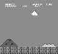
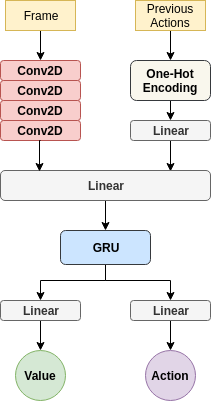

# Super Mario Agent

The reinforcement learning [PPO](https://arxiv.org/abs/1707.06347) agent that
plays Super Mario Bros in [emulated environment](https://github.com/Kautenja/gym-super-mario-bros).

<p align="center">
  
  
  
</p>

# Quick Start

Requirements: `python 3.5+` and `pip`.

Install dependencies with

```
pip install -r requirements.txt
```

*NOTE* It is recommended to install dependencies in virtual environment.


## Running an agent

Some pretrained models are uploaded to `models/` directory.

To run an agent on world 1 and stage 1 run

```
python run.py --world=1 --stage=1
```

See `python run.py -h` for more options.

Agent runs until it finishes given level. If agent dies, level is restarted.
Agent can be stopped with `CTRL + C`.

## Training

Training process is started with

```
python train.py
```

All available arguments and their default values are described in `args.py`.
Training visualization is done with tensorboard, so after starting training
process run

```
tensorboard --logdir runs/<training-timestamp>
```

to start tensorboard server. `<training-timestamp>` corresponds to timestamp
when `python train.py` is executed.

# Details

RL algorithms hide a lot of implementation tricks and they are highly sensitive
to parameters change. Often, it is painful to search for an optimal
actor-critic architecture, observation image preprocessing steps, etc.

This section provides information about such tricks that are used to
successfully train an agent to play Super Mario Bros game.

## States

State (observation) is a single in-game frame. Frames are converted to
grayscale and resized from 256x224 to 96x90 pixels.  Grayscale frame speeds up
training and it takes less GPU memory.

 &nbsp;&nbsp; is converted to &nbsp;&nbsp; 

One in-game second takes 25 frames. Consequently, those 25 frames are very
similar, just like actions that are taken in those frames (states) and rewards.
This slows down training.  To overcome this problem, stochastic frame skipping
is used where each _n-th_ frame is taken as state, and provided action is
repeated with probability _p_. Rewards are summed over skipped frames.

## Actions

Possible actions correspond to valid NES controller button combinations:

```c
NOOP,
right,
right + A,
right + B,
right + A + B,
A,
left,
left + A,
left + B,
left + A + B,
down,
up
```

where `A` is jump, and `B` is sprint/fire action.

## Reward

The reward function assumes the objective of the game is to move as far right
as possible (increase the agent's x value), as fast as possible, without dying.
Total reward is calculated as:

```
R = V + T + D + S
```

where:

- `V` is the difference in agent x coordinate values between states,
- `T` is the difference in the game clock between frames,
- `D` is a death penalty that penalizes the agent for dying in a state or
a level completed reward if agent gets to the flag at the end of level,
- `S` is the difference in in-game score between frames.

Total reward is scaled down by some factor.

## Actor-Critic Network

Current state (grayscale frame) and previously taken actions are input to a
actor-critic network. Frame goes through convolutional block, while previous
actions are one-hot encoded and passed through a fully-connected layer. Those
two outputs are concatenated and passed to another fully-connected layer. After
that, output is passed to GRU with previous hidden state. Finally, GRU output
is goes through 2 separate fully-connected layers corresponding to state value
and action distribution.

<p align="center">
  
</p>

# License

This project is provided for educational purposes only. It is not affiliated
with and has not been approved by Nintendo.
